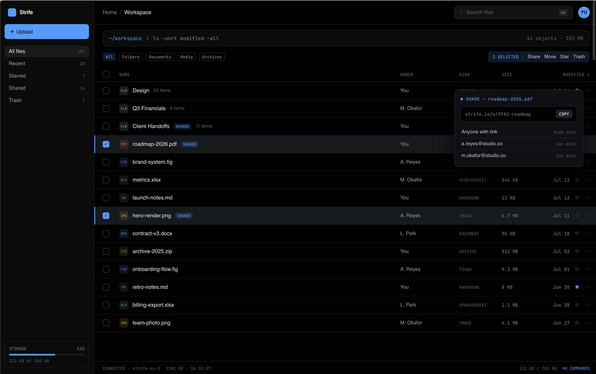

# Strife — v1 Product and Implementation Plan



[Open the hosted SolidJS frontend preview](https://s4njee.github.io/strife/).

## 1. Product Definition

Strife v1 is a single-user, self-hosted cloud drive for a private home LAN. It provides durable file and folder management, resumable browser uploads, watched-folder imports, rich metadata extraction, and on-demand previews through a SolidJS interface backed by Axum and PostgreSQL.

The first release is intentionally not a complete public cloud service. It assumes a trusted LAN, has no sign-in flow, and does not include OCR, global search, public sharing, production backup automation, or production security hardening. Those subjects are tracked in [`deferred.md`](deferred.md).

Development proceeds in small vertical slices. Every milestone must leave the application runnable and testable.

## 2. Settled v1 Decisions

| Area | Decision |
|---|---|
| Users | Single-user |
| Network | Private LAN only; normal operation must not require internet access |
| Authentication | None in v1 |
| Host | Gentoo Linux on Raspberry Pi 5, ARM64, 4 GB RAM |
| Additional architecture | x86-64 must also be supported |
| Capacity | 5 TB external HDD mounted at `/mnt/ext` |
| Storage backend | Direct opaque-key storage on a reformatted ZFS volume; no MinIO in v1 |
| Managed paths | Strife owns `/mnt/ext/strife`; storage and import roots are separate subtrees |
| Database | PostgreSQL |
| Frontend | SolidJS with TypeScript |
| Backend | Rust with Axum and Tokio |
| Deployment direction | Docker Compose; packaged deployment is deferred, so v1 starts with a development setup |
| Uploads | Resumable and chunked; no Strife-configured per-file size limit |
| Import | Watch a server-side folder and import discovered files into Strife |
| Duplicate sibling name | Reject the operation |
| File versions | Not supported |
| Integrity | Calculate checksums, but do not deduplicate content |
| Disk guard | Reject new uploads/imports at 90% disk usage |
| Usage display | Originals, trash, and generated artifacts all count |
| Trash | Retain for 30 days; explicit permanent deletion removes bytes immediately |
| Metadata | ExifTool, Apache Tika, ffprobe, and format-specific tools as appropriate |
| Previews | Images, video, audio, PDF, and DOCX; generated on demand and cached |
| Video | Do not transcode unsupported codecs in v1 |
| Interface | Desktop table view only; no gallery or mobile/tablet layout |
| Themes | True-black dark theme plus a light theme |
| Browser support | Current stable desktop browsers only |
| OCR, search, sharing | Deferred to v2 |

## 3. v1 Scope

### Included

- Persisted folder hierarchy
- Create, rename, move, trash, restore, and permanently delete files and folders
- Case-sensitive names with no Strife-specific prohibited-character list
- Empty folders
- Strict, atomic rejection of moves or uploads that create sibling-name conflicts
- Resumable chunked uploads with folder upload and relative hierarchy preservation
- Preservation of source creation and modification timestamps when the source provides them
- Server-side watched-folder import
- Authorized-by-network file download and HTTP range streaming
- Checksum verification without content deduplication
- Rich metadata for common documents, images, raw camera images, audio, and video
- Generic metadata for unsupported formats
- Gradual background metadata reprocessing after extractor/schema changes
- On-demand, cached previews for supported types
- Storage and background-processing status that survives page reloads
- Favorites, selection, sorting, context menus, trash, and storage usage
- Filesystem-like commands in the command bar
- Desktop file-manager selection behavior, including Shift and Cmd/Ctrl selection
- Dark and light themes

### Explicitly excluded

- Authentication and account recovery
- OCR and handwriting recognition
- Global filename, metadata, document-content, or OCR search
- Public or private share links
- Video transcoding
- Editable file metadata
- Extracted cover art, audio waveforms, embedded document attachments, or archive listings
- File version history
- Content deduplication
- Symbolic links or special-file imports
- Grid/gallery and mobile/tablet views
- Production packaging, Kubernetes deployment, backup automation, and comprehensive security hardening

See [`deferred.md`](deferred.md) for questions that may define v2 or later.

## 4. Target Environment

The primary development target is a Raspberry Pi 5 with 4 GB of RAM and a 5 TB external HDD mounted at `/mnt/ext`. The software must remain usable without an internet connection and must avoid dependencies on external CDNs, hosted fonts, cloud APIs, or remote metadata services.

The Rust services, frontend assets, PostgreSQL setup, and external processing tools must run on ARM64. The code and eventual container images must also support x86-64. Memory-heavy extractors need explicit concurrency limits appropriate to a 4 GB host.

Foundation choices are recorded in [ADR 0001](docs/decisions/0001-primary-host-platform.md), [ADR 0002](docs/decisions/0002-zfs-storage-backend.md), and [ADR 0003](docs/decisions/0003-managed-storage-layout.md).

## 5. Architecture

```text
SolidJS web app
      |
      | LAN HTTP / JSON / byte ranges
      v
Axum API -------------------------------- PostgreSQL
      |                                       | nodes and file objects
      |                                       | upload sessions
      |                                       | metadata and jobs
      |                                       | import state
      v                                       |
Storage abstraction                           |
      |                                       |
      v                                       |
ZFS-backed managed directory                   |
      ^                                       |
      |                                       |
Background worker <---------------------------+
  | libmagic / ExifTool
  | ffprobe
  | Apache Tika
  | image/RAW and office-preview adapters
  +----> cached derived artifacts

Watched folder ----> importer ----> the same finalize/job pipeline
```

### Frontend

- SolidJS, TypeScript, and Vite
- Locally bundled fonts and assets for offline operation
- Route-based folder navigation
- A small typed API client
- Server-backed upload and processing state; local state for selection, menus, sorting, and dialogs
- Custom components guided by the supplied design rather than an assumed large UI framework

### Backend

- Axum for APIs and streaming responses
- Tokio for asynchronous I/O
- SQLx for PostgreSQL queries and checked migrations
- A separate worker binary sharing domain, database, storage, and media crates
- Structured JSON logs with request, upload, import, and job correlation IDs
- Bounded worker concurrency and child-process resource limits

Suggested workspace shape:

```text
apps/
  web/                 SolidJS application
crates/
  api/                 Axum binary and HTTP layer
  worker/              metadata and preview worker
  domain/              file/folder rules and state machines
  storage/             opaque-key storage abstraction
  db/                  PostgreSQL queries and migrations
  media/               extractor and preview adapters
  importer/            watched-folder discovery and ingestion
```

### Development orchestration

Use a development Docker Compose configuration for PostgreSQL, Apache Tika, and any other service dependencies. The Rust and SolidJS applications may run through native development commands initially. Release containers, a polished deployment Compose file, and Kubernetes manifests are v2 concerns.

## 6. Storage Model

Original bytes and generated artifacts live outside PostgreSQL. PostgreSQL holds the virtual hierarchy, lifecycle state, storage keys, upload/import progress, metadata, and background jobs.

- Use a direct ZFS-backed managed directory for v1; MinIO is not a v1 service.
- Hide it behind a small storage interface from the beginning.
- Use opaque generated keys; never use display names as physical paths.
- Under `/mnt/ext/strife`, use separate namespaces for staging uploads, originals, cached artifacts, and the non-overlapping import inbox as defined by ADR 0003.
- Finalize writes atomically.
- Compute a cryptographic checksum while receiving/importing bytes and verify it during finalization.
- Do not merge identical files or expose checksum-based identity to the user.
- Refuse application startup if the configured storage backend is missing or unwritable.
- Refuse new uploads and watched-folder imports when the storage volume reaches 90% used.
- Show usage including original bytes, cached previews/thumbnails, and trashed files.

There is no application quota below the disk guard and no configured maximum file size. Actual uploads remain bounded by available space, protocol integer ranges, and host resources; implementations must stream data rather than buffer whole files.

## 7. Core Data Model

Names remain provisional until the schema-design step.

### Hierarchy and files

- `nodes`: stable ID, parent ID, display name, file/folder kind, lifecycle state, source timestamps, Strife timestamps
- `file_objects`: node ID, opaque storage key, byte size, detected MIME, checksum, upload state
- `favorites`: node ID and timestamp
- `trash_entries`: node ID, original parent, trashed time, scheduled purge time

There is no `users`, `sessions`, `shares`, `versions`, or deduplication table in v1.

Database constraints and transactions must enforce:

- case-sensitive uniqueness of live sibling names;
- no folder cycles;
- atomic failure when a move has any destination conflict;
- a file has exactly one finalized original object;
- empty folders are valid;
- explicit permanent deletion and scheduled 30-day trash cleanup are idempotent.

PostgreSQL `text` stores names and virtual paths without a Strife-defined length limit. HTTP and database safety limits may still reject inputs that cannot be processed safely; physical filesystem filename limits do not apply because storage keys are opaque.

### Metadata and derivatives

- `metadata_records`: file, extractor name/version, extraction status, structured raw payload, warnings, timestamps
- `media_streams`: normalized video/audio stream facts useful to the details UI
- `derived_artifacts`: file, artifact type, dimensions/format, storage key, generator version, state, timestamps
- typed columns for frequently displayed/sorted fields, with the exact set still open

### Processing, upload, and import

- `jobs`: type, target, state, priority, attempts, lease owner/expiry, last error, timestamps
- `upload_sessions`: target folder, display/source data, expected byte size, received chunks/ranges, staging key, expiry, state
- `import_sources`: configured watch path, destination folder, enabled/state fields, scan cursor/timestamps
- `import_entries`: source identity/path, observed attributes, checksum/finalization state, resulting node, error

Use PostgreSQL as the initial durable job queue with `FOR UPDATE SKIP LOCKED`, expiring leases, retries, and idempotent handlers.

## 8. File and Folder Semantics

- Names are case-sensitive.
- Strife does not prohibit specific characters or impose its own name/path-length limit.
- Empty folders are allowed.
- Duplicate live sibling names are rejected.
- A conflicting multi-item or folder move fails as one transaction; v1 does not partially resolve conflicts.
- Uploading a duplicate name does not overwrite, rename, or create a version.
- Original filesystem creation and modification timestamps are preserved when available; Strife also records its own ingestion and mutation timestamps.
- File versions are not retained.
- Checksums detect corruption only; identical content remains separate.
- Symbolic links, aliases, devices, sockets, and other special files are not imported.
- Items stay in trash for 30 days and count toward usage.
- A user-requested permanent deletion removes the original and cached derivatives immediately through an idempotent deletion job.

## 9. Upload and Watched-Folder Ingestion

Browser uploads and watched-folder imports converge on one finalization pipeline.

1. **Reserve:** validate destination, name conflicts, current disk usage, declared size when known, and source metadata.
2. **Receive or copy:** accept resumable chunks into staging, or stream a watched file into staging; never buffer the complete file in memory.
3. **Track durably:** persist received ranges and state so upload progress survives reloads and service restarts.
4. **Verify:** confirm size where known, compute/verify checksum, reject special files, and detect actual MIME from content.
5. **Finalize:** atomically commit the storage object and database node while preserving source timestamps.
6. **Enqueue:** create metadata jobs; previews remain on-demand.
7. **Report:** expose `uploading`, `importing`, `processing`, `ready`, `partially processed`, or `failed` states.

Folder uploads preserve relative hierarchy and fail safely on conflicts. Job and finalization handlers must be idempotent so retries do not duplicate nodes or artifacts.

The v1 importer has one fixed inbox at `/mnt/ext/watch`, mapped to the Strife root with relative hierarchy preserved. Scans are initiated manually, and files are accepted only if their size and modification time remain unchanged while they stream into staging. After durable finalization, the source is removed; failures leave it in place and are recorded as actionable errors. Strife does not monitor paths after they leave the inbox and never overwrites a conflicting node. See [ADR 0004](docs/decisions/0004-watched-folder-import.md).

## 10. Metadata Pipeline

Metadata processing is asynchronous and must never prevent an otherwise valid original from being stored.

### Initial format coverage

- Documents: DOC, DOCX, PDF, and other formats Apache Tika can inspect safely
- Images: JPEG, PNG, GIF, common modern image formats, and raw camera formats
- Video: MP4, MKV, MOV, and other formats recognized by ffprobe
- Audio: MP3, M4A, and other formats recognized by ffprobe
- Unsupported formats: generic name, size, MIME, checksum, and timestamps

### Initial tools

| Content | Tool | Output |
|---|---|---|
| All files | libmagic/`file`, checksum library | detected MIME and integrity checksum |
| Images | ExifTool plus an image/RAW adapter | dimensions, orientation, EXIF/IPTC/XMP, camera, GPS, capture time, color information |
| Video/audio | ffprobe | container, codecs, streams, duration, bitrate, resolution, frame rate, language, tags |
| PDF/office | Apache Tika plus PDF utilities where useful | title, author, dates, page/sheet counts, document properties |

GPS metadata is displayed. Metadata is read-only in v1. Do not extract cover art, waveforms, embedded attachments, or archive listings.

Record extractor versions and warnings. Preserve every successful raw metadata JSON result in full, targeting 10–15 GB per million files, and normalize common UI fields into a one-to-one typed metadata record. Tika document text and OCR text are stored separately from metadata JSON. The v1 acceptance matrix is DOC, DOCX, PDF, JPEG, GIF, PNG, NEF, DNG, MP4, MKV, MOV, MP3, and M4A; see [ADR 0005](docs/decisions/0005-metadata-storage-and-format-matrix.md). When an extractor or schema changes, enqueue gradual low-priority reprocessing rather than blocking startup.

## 11. Preview Pipeline

Previews are requested on demand, generated asynchronously when necessary, then cached as derived artifacts.

- Image and raw-camera preview
- Animated GIF preview with animation enabled
- Browser-native video playback when the original codec is supported
- Browser-native audio playback
- PDF preview
- DOCX preview rendered to a browser-safe derivative
- Approximately 256×256 cached thumbnails where a thumbnail is useful

Do not transcode video in v1. If a browser cannot preview a file or codec, download the original instead. Do not generate audio waveforms or extracted cover art.

The first request for a missing preview may return a processing state and job identifier. The UI polls or refreshes durable job state, so preview progress survives a reload. Office-preview tooling remains an active design question.

## 12. v1 API Capabilities

- Health/readiness, including PostgreSQL, storage availability, disk usage, and required extractor status
- Folder listing and details
- Create, rename, move, trash, restore, permanently delete, and favorite
- Initiate upload, accept/query chunks, finalize, cancel, and inspect progress
- Register/manage the watched import source and inspect import status/errors
- File details and extracted metadata
- Request and inspect preview generation
- Download originals and serve range requests
- Storage usage and processing/job status

Use stable opaque IDs. File listings should support cursor pagination, column sorting, and kind filters. Mutations return the updated resource or conflict details so the UI need not reload the whole folder.

With no v1 authentication, every client that can reach the API has full control. Bind and expose the service only as deliberately configured for the private LAN.

## 13. v1 Interface

The visual source is `design_handoff_strife_files_browser/README.md`, especially artboard `#3a` at 1440×900.

- Desktop sidebar, breadcrumb/topbar, command bar, filters, dense metadata table, selection actions, and status footer
- Table view only
- True-black dark theme plus light theme using shared semantic tokens
- Current stable desktop browsers only
- Single click selects; checkbox toggles multi-selection
- Shift and Cmd/Ctrl follow desktop file-manager selection conventions
- Double-clicking a folder opens it
- Double-clicking a file previews it when supported and downloads it otherwise
- A context menu appears for selected rows and exposes relevant file operations
- Sortable columns, kind filters, favorites, and multi-item actions
- Upload picker, entire-folder upload, drag/drop, durable progress, cancellation, and conflict reporting
- Processing and preview status survives reload through server-side job state
- Low-disk state is a persistent notification; routine completed actions and recoverable errors can use transient messages
- Command bar accepts filesystem-like commands rather than being decorative

The exact v1 command grammar and command list remain open. The separate command palette is deferred to v2.

## 14. v1 Safety and Operational Baseline

Although broad security and production operations are deferred, v1 still needs basic data-safety invariants:

- Never construct storage paths from display names.
- Detect MIME from bytes rather than trusting extensions.
- Stream unbounded-size files and enforce bounded memory use.
- Run extractor processes with concurrency, timeout, and output-size limits suitable for 4 GB RAM.
- Use safe response headers; only controlled preview routes render content inline.
- Do not log file contents, metadata payloads, or checksums unnecessarily.
- Refuse startup when PostgreSQL or configured storage is unavailable.
- Reject new ingestion at 90% disk use and display a persistent warning.
- Keep originals intact when metadata or preview processing fails.
- Make finalization, retry, trash cleanup, and permanent deletion idempotent.

Authentication, antivirus, stronger process isolation, encryption policy, audit retention, public-sharing security, backup/restore automation, and production monitoring are deferred.

## 15. Testing Strategy for v1

- Domain tests for hierarchy, case-sensitive conflicts, moves, trash timing, and lifecycle transitions
- Database integration tests for migrations, constraints, upload ranges, job leases, retries, and importer idempotency
- API tests for chunked upload/finalization, folder upload, downloads/ranges, conflicts, metadata, and preview state
- Small representative fixtures for initial document, image/RAW, video, and audio formats
- Malformed-file fixtures for extractor timeout/error handling
- Frontend tests for navigation, selection, context menus, both themes, upload progress, low-disk warnings, and preview fallback
- End-to-end test: create folder → resumable upload → metadata → preview/download → trash → restore/delete
- Import test: watched file → stable detection → one finalized node → metadata → restart without duplication
- Visual comparison of the dark desktop browser against artboard `#3a`
- ARM64 testing on the Raspberry Pi target and build compatibility for x86-64

Exact CI, performance targets, accessibility level, and release-platform matrix are deferred; tests required to protect implemented behavior are not.

## 16. Incremental Milestones

### Milestone 0 — Resolve foundations and scaffold

- Apply the accepted host and storage decisions in ADRs 0001–0003; watched-folder behavior is resolved before Milestone 3.
- Create the Rust workspace and SolidJS app.
- Add formatting, linting, migrations, and basic tests.
- Add development Compose services for PostgreSQL and Apache Tika.
- Add API/worker configuration for `/mnt/ext` without hard-coding deployment-specific subpaths.
- Add health/readiness and frontend-to-API connectivity.
- Establish local fonts and dark/light semantic design tokens.

**Done when:** the frontend, API, worker, PostgreSQL, and Tika can run in development on the ARM64 target without internet access, and the Rust project builds for x86-64.

### Milestone 1 — Persist and browse folders

- Create the hierarchy schema and implicit single-user root.
- Implement folder list/create/rename/move with strict conflict behavior.
- Build the application shell, folder navigation, file table, selection model, and context menu.
- Add both themes and loading/empty/error states.

**Done when:** folders persist across restarts and all hierarchy invariants are enforced through both API and UI.

### Milestone 2 — Resumable upload and download

- Implement the chosen storage backend and opaque keys.
- Implement upload sessions, durable chunk/range tracking, checksum, atomic finalization, and stale-staging cleanup.
- Preserve source timestamps, support folder uploads, and reject duplicate names.
- Add original downloads and HTTP range requests.
- Build upload picker, drag/drop, progress restoration, cancellation, and low-disk behavior.

**Done when:** a file larger than available RAM can be interrupted, resumed after reload/restart, finalized exactly once, and downloaded byte-for-byte identically.

### Milestone 3 — Watched-folder import

- Implement the decided watch and destination rules.
- On manual request, discover regular files and directories; ignore hidden and special files, and reject files that change during staging.
- Stream through the same checksum/finalization path as uploads.
- Preserve hierarchy and timestamps, enforce conflict and disk rules, and record actionable errors.

**Done when:** adding a tree to the watch source imports it once, survives restarts, and never duplicates or partially publishes a file.

### Milestone 4 — Metadata extraction

- Add libmagic, ExifTool, ffprobe, Apache Tika, and raw-image adapters.
- Add durable job leases, bounded concurrency, retries, timeouts, versioned results, and gradual reprocessing.
- Populate normalized details plus raw metadata under the selected retention policy.
- Build processing state and metadata/details UI.

**Done when:** representative documents, images, raw files, audio, and video gain useful metadata without delaying ingestion, and unsupported files remain usable with generic metadata.

### Milestone 5 — On-demand previews

- Add approximately 256×256 thumbnails and preview artifact caching.
- Add image/animated GIF/RAW, native audio/video, PDF, and DOCX previews.
- Add durable request/status/retry behavior and download fallback.
- Verify that no video transcoding, waveform, cover-art, or attachment extraction slips into v1.

**Done when:** supported files preview on request, cached artifacts are reusable and accounted for, and unsupported codecs/formats download cleanly.

### Milestone 6 — Complete v1 file management and UI

- Add trash/restore/permanent deletion and automatic 30-day cleanup.
- Add favorites, filters, sorting, complete multi-selection actions, and filesystem command-bar actions.
- Finish dark/light visual states, persistent low-disk notification, storage meter, and status footer.
- Verify progress restoration and failures across reloads.

**Done when:** the agreed desktop workflows operate on real persisted data and all v1 decisions are represented in behavior.

### Milestone 7 — v1 stabilization

- Run the v1 test matrix on ARM64 and build/verify x86-64 compatibility.
- Test low disk, missing storage at startup, interrupted uploads, worker crashes, malformed files, and deletion retries.
- Tune worker concurrency for the 4 GB Raspberry Pi.
- Document development startup, configuration, supported formats, known limitations, and data layout.
- Reconcile `README.md`, `questions.md`, and `deferred.md` with the shipped behavior.

**Done when:** v1 can be used reliably on the target private LAN in its documented development configuration, with no unresolved v1-blocking questions.

## 17. Active v1 Decisions

Only unresolved v1 decisions remain in [`questions.md`](questions.md):

1. Watched-folder ownership and change semantics
2. Raw metadata size/retention policy
3. First-class normalized metadata columns
4. DOCX/office and raw-image preview renderers
5. Initial command-bar grammar and commands

Resolve each shortly before the milestone that needs it. Material choices should become short Architecture Decision Records under `docs/decisions/`.

## 18. Living-Plan Rules

- Mark completed work and link to the relevant code, migration, or decision record.
- Keep v1 scope separate from [`deferred.md`](deferred.md).
- Do not silently expand a milestone; record the tradeoff and defer lower-priority work.
- Revisit extractor choices using representative fixtures and measurements on the Raspberry Pi.
- Keep this plan aligned with what is currently runnable and tested.
