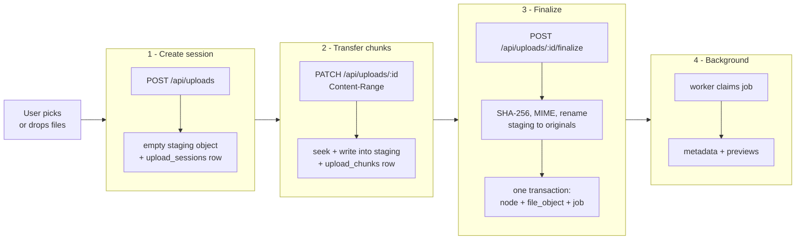
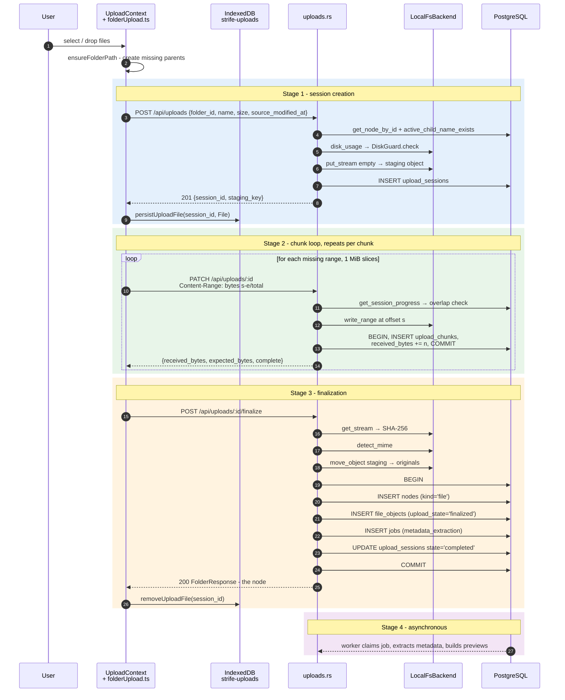
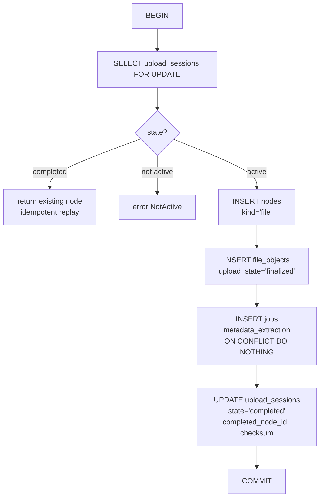
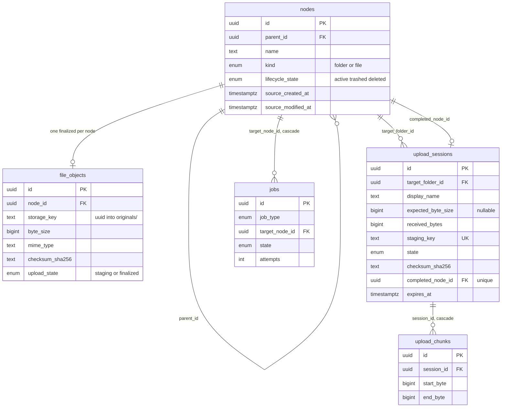
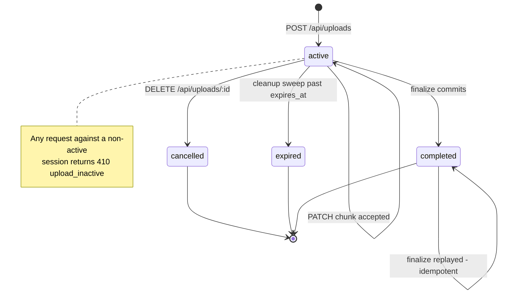
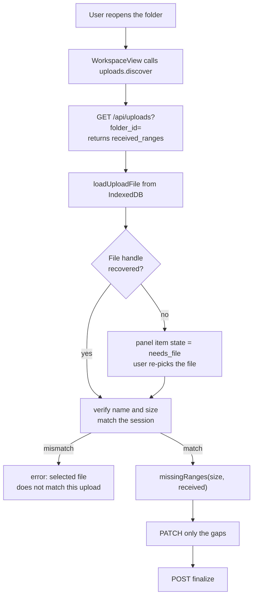
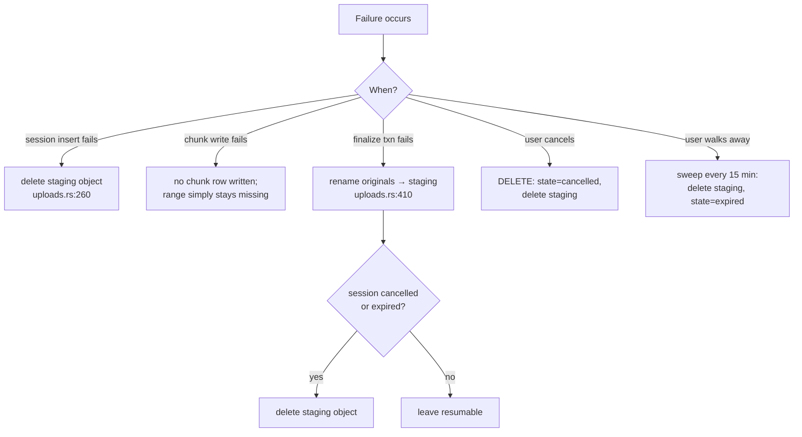

# Strife — Upload Data Flow

How a file travels from the user's browser to managed storage and PostgreSQL, and which source files own each step.

> [!NOTE]
> This document describes the **basic upload mechanism** (`POST /api/uploads` → chunks → finalize) and the **database mechanism** behind it. Watched-folder import is a separate ingestion path that shares the storage layer and the `nodes`/`file_objects` tables but not the upload session machinery. See [`crates/importer/src/lib.rs`](crates/importer/src/lib.rs).

---

## 1. The short version

A file becomes a row in `nodes` through four stages. Bytes and metadata travel separately: bytes go to the filesystem, and the database only ever stores a *key* pointing at them.



**The invariant that makes this safe:** bytes are durably on disk in `originals/` *before* the database transaction opens, and the transaction is the single atomic moment where the file becomes visible. If the transaction fails, the API renames the object back to `staging/` ([uploads.rs:410](crates/api/src/uploads.rs#L410)) so no orphan exists in either direction.

---

## 2. End-to-end sequence



---

## 3. Stage-by-stage detail

### Stage 1 — Session creation

| Step | Where | What happens |
|---|---|---|
| Validate name | [uploads.rs:201](crates/api/src/uploads.rs#L201) | `FolderRules::validate_name` — rejects empty names |
| Validate size | [uploads.rs:203](crates/api/src/uploads.rs#L203) | Rejects negative `size`; `size` is optional |
| Resolve folder | [uploads.rs:207](crates/api/src/uploads.rs#L207) | Must exist, be `kind='folder'`, and be `lifecycle_state='active'` |
| Name conflict | [uploads.rs:214](crates/api/src/uploads.rs#L214) | `active_child_name_exists` → `409 name_conflict` |
| Capacity guard | [uploads.rs:221](crates/api/src/uploads.rs#L221) | `DiskGuard::check(usage, size)` → `507 disk_full` with `usage_percent` |
| Reserve bytes | [uploads.rs:236](crates/api/src/uploads.rs#L236) | `put_stream` of an **empty** reader creates `staging/<uuid>` |
| Persist session | [db/lib.rs:1308](crates/db/src/lib.rs#L1308) | `INSERT INTO upload_sessions … RETURNING *` |
| Rollback | [uploads.rs:260](crates/api/src/uploads.rs#L260) | If the insert fails, the staging object is deleted; SQLSTATE `23505` maps to `409` |

The staging object is created **before** the database row, so a crash between the two leaves an orphaned zero-byte file rather than a session pointing at nothing.

### Stage 2 — Chunk transfer

| Step | Where | What happens |
|---|---|---|
| Parse header | [uploads.rs:589](crates/api/src/uploads.rs#L589) | `bytes {start}-{end}/{total}`; `total` may be `*`. Rejects `start<0`, `end<start`, `total<=end` |
| Session must be live | [uploads.rs:526](crates/api/src/uploads.rs#L526) | Any state other than `active` → `410 upload_inactive` |
| Total must agree | [uploads.rs:529](crates/api/src/uploads.rs#L529) | A stated `total` must equal `expected_byte_size` |
| Overlap pre-check | [uploads.rs:534](crates/api/src/uploads.rs#L534) | Against `received_ranges` → `409 range_conflict` |
| Write bytes | [storage/lib.rs:214](crates/storage/src/lib.rs#L214) | Open with `truncate(false)`, `seek(offset)`, stream body in |
| Length check | [uploads.rs:561](crates/api/src/uploads.rs#L561) | Bytes written must equal `end - start + 1`, else `400` |
| Record range | [db/lib.rs:1346](crates/db/src/lib.rs#L1346) | Transaction: `SELECT … FOR UPDATE` → overlap re-check → `INSERT upload_chunks` → `received_bytes += n` |

Overlap is checked **twice** — once optimistically from the progress read, once inside the transaction under a row lock. Only the second is authoritative.

The chunk request body is streamed, never buffered: `body.into_data_stream()` → `StreamReader` → `tokio::io::copy` ([uploads.rs:544](crates/api/src/uploads.rs#L544)). Memory use is independent of chunk size.

### Stage 3 — Finalization

| Step | Where | What happens |
|---|---|---|
| Idempotency | [uploads.rs:345](crates/api/src/uploads.rs#L345) | Already `completed` → return the existing node, no side effects |
| State gate | [uploads.rs:356](crates/api/src/uploads.rs#L356) | Not `active` → `410 upload_inactive` |
| Completeness | [uploads.rs:359](crates/api/src/uploads.rs#L359) | `received_bytes` must equal `expected_byte_size` → else `400 upload_incomplete` |
| Checksum | [uploads.rs:491](crates/api/src/uploads.rs#L491) | Streams the staging object through SHA-256 in 64 KiB blocks |
| MIME | [storage/lib.rs:241](crates/storage/src/lib.rs#L241) | Shells out to `file --brief --mime-type` |
| Promote bytes | [storage/lib.rs:235](crates/storage/src/lib.rs#L235) | `fs::rename` from `staging/` to `originals/` |
| Commit | [db/lib.rs:1596](crates/db/src/lib.rs#L1596) | Single transaction, detailed below |
| Compensate | [uploads.rs:410](crates/api/src/uploads.rs#L410) | On failure, rename back to `staging/`; if the session was cancelled or expired, delete it instead |

The finalize transaction ([db/lib.rs:1596](crates/db/src/lib.rs#L1596)) does exactly five things:



`source_created_at` and `source_modified_at` carry from the session onto the node, preserving the browser-reported `File.lastModified`.

### Stage 4 — Background processing

The `jobs` row inserted at finalize is the handoff. The worker process polls it independently; the API never waits. See [crates/worker/src/metadata.rs](crates/worker/src/metadata.rs).

---

## 4. HTTP API surface

All routes are mounted by [`uploads::router`](crates/api/src/uploads.rs#L41).

| Method | Path | Request | Success | Handler |
|---|---|---|---|---|
| `POST` | `/api/uploads` | JSON `{folder_id, name, size?, source_created_at?, source_modified_at?}` | `201 {session_id, staging_key}` | [`create_upload`](crates/api/src/uploads.rs#L197) |
| `GET` | `/api/uploads?folder_id=` | — | `200 [UploadSessionResponse]` | [`list_uploads`](crates/api/src/uploads.rs#L289) |
| `PATCH` | `/api/uploads/{id}` | Raw bytes + `Content-Range` | `200 {received_bytes, expected_bytes, complete}` | [`upload_chunk`](crates/api/src/uploads.rs#L509) |
| `GET` | `/api/uploads/{id}` | — | `200 UploadSessionResponse` with `received_ranges` | [`get_upload`](crates/api/src/uploads.rs#L278) |
| `POST` | `/api/uploads/{id}/finalize` | — | `200 FolderResponse` — the created node | [`finalize_upload`](crates/api/src/uploads.rs#L337) |
| `DELETE` | `/api/uploads/{id}` | — | `204 No Content` | [`cancel_upload`](crates/api/src/uploads.rs#L436) |

### Error codes

Bodies are `{code, message}`, with two extra fields on the disk-full case ([uploads.rs:108](crates/api/src/uploads.rs#L108)).

| Status | `code` | Cause |
|---|---|---|
| `400` | `bad_request` | Empty name, negative size, bad `Content-Range`, body length mismatch |
| `400` | `upload_incomplete` | Finalize called with missing bytes |
| `404` | `not_found` | Folder, session, or staging object missing |
| `409` | `name_conflict` | Active sibling or active session already uses the name |
| `409` | `range_conflict` | Byte range already received |
| `410` | `upload_inactive` | Session cancelled, expired, finalizing, or completed |
| `507` | `disk_full` | `DiskGuard` threshold exceeded; body adds `usage_percent` and a duplicate `error` field |
| `500` | `internal_error` | Database or storage failure |

---

## 5. Source files by layer

### Frontend — `apps/web/src/`

| File | Role in the upload path |
|---|---|
| [`components/FileUploadControl.tsx`](apps/web/src/components/FileUploadControl.tsx) | Hidden `<input type="file" multiple>`; calls `uploads.start` |
| [`components/FolderUploadControl.tsx`](apps/web/src/components/FolderUploadControl.tsx) | Hidden `<input webkitdirectory>`; whole-tree upload with a completion report |
| [`uploads/dropFiles.ts`](apps/web/src/uploads/dropFiles.ts) | Walks `DataTransfer` `FileSystemEntry` trees into a flat `UploadCandidate[]` with relative paths |
| [`views/WorkspaceView.tsx`](apps/web/src/views/WorkspaceView.tsx#L376) | Drag-and-drop handlers; calls `collectDroppedFiles` then `uploads.start` |
| [`uploads/UploadContext.tsx`](apps/web/src/uploads/UploadContext.tsx) | Reactive queue state, `AbortController` registry, session discovery, resume orchestration |
| [`uploads/folderUpload.ts`](apps/web/src/uploads/folderUpload.ts) | **The engine.** Concurrency, chunk slicing, `missingRanges`, `ensureFolderPath` |
| [`uploads/uploadPersistence.ts`](apps/web/src/uploads/uploadPersistence.ts) | IndexedDB store of `File` handles keyed by session id |
| [`api/client.ts`](apps/web/src/api/client.ts#L593) | `createUploadSession`, `uploadFileChunk`, `finalizeUpload`, `cancelUpload`, `getActiveUploads` |
| [`api/types.ts`](apps/web/src/api/types.ts) | `UploadSession`, `CreatedUploadSession`, `UploadByteRange` |
| [`components/UploadProgressPanel.tsx`](apps/web/src/components/UploadProgressPanel.tsx) | Floating progress panel, mounted in `App.tsx` so it survives navigation |
| [`components/StorageWarning.tsx`](apps/web/src/components/StorageWarning.tsx) | Polls readiness; disables upload controls at ≥90% |

Key constants in [`folderUpload.ts`](apps/web/src/uploads/folderUpload.ts#L11):

| Constant | Value | Note |
|---|---|---|
| `DEFAULT_CHUNK_SIZE` | `VITE_UPLOAD_CHUNK_SIZE_BYTES`, else **1 MiB** | Must be a positive safe integer or the default applies |
| `MAX_CONCURRENT_UPLOADS` | **3** | Concurrent *files*. Chunks within one file are strictly sequential |

### API — `crates/api/src/`

| File | Role |
|---|---|
| [`uploads.rs`](crates/api/src/uploads.rs) | All six endpoints, `Content-Range` parsing, SHA-256, the finalize orchestration and its compensating rollback |
| [`lib.rs`](crates/api/src/lib.rs#L146) | Mounts the router; spawns `spawn_upload_cleanup` — a 15-minute expiry sweep |
| [`config.rs`](crates/api/src/config.rs) | `UPLOAD_SESSION_TTL_HOURS` (default 24), `DISK_GUARD_PERCENT` (default 90) |
| [`folders.rs`](crates/api/src/folders.rs) | `FolderResponse`, the shape finalize returns; `ensureFolderPath` calls its create/list routes |
| [`storage_usage.rs`](crates/api/src/storage_usage.rs) | `/api/storage/usage` — the capacity figures the UI shows |

### Domain — [`crates/domain/src/lib.rs`](crates/domain/src/lib.rs)

Stateless rules only. `FolderRules::validate_name` is the sole domain call in the upload path; `NodeKind` and `LifecycleState` gate the target folder.

### Storage — [`crates/storage/src/lib.rs`](crates/storage/src/lib.rs)

| Item | Role |
|---|---|
| `StorageBackend` trait ([:133](crates/storage/src/lib.rs#L133)) | `put_stream`, `write_range`, `move_object`, `get_stream`, `detect_mime`, `delete`, `exists`, `disk_usage` |
| `StorageKey` ([:39](crates/storage/src/lib.rs#L39)) | Opaque `(namespace, uuid)` pair — never a user-supplied path |
| `StorageNamespace` ([:21](crates/storage/src/lib.rs#L21)) | `Staging` / `Originals` / `Artifacts` |
| `DiskGuard` ([:86](crates/storage/src/lib.rs#L86)) | Percentage threshold shared by upload and import |
| `LocalFsBackend::path_for` ([:177](crates/storage/src/lib.rs#L177)) | `root/<namespace>/<uuid-simple>` |

### Database — `crates/db/src/`

| Function | Line | Role |
|---|---|---|
| `create_session` | [1308](crates/db/src/lib.rs#L1308) | Inserts the session row |
| `record_chunk` | [1346](crates/db/src/lib.rs#L1346) | Transactional range insert + `received_bytes` increment |
| `get_session_progress` | [1417](crates/db/src/lib.rs#L1417) | Session plus ordered `received_ranges` — the resume payload |
| `finalize_upload` | [1596](crates/db/src/lib.rs#L1596) | The five-statement commit transaction |
| `cancel_session` | [1478](crates/db/src/lib.rs#L1478) | → `cancelled` |
| `expire_session` | [1507](crates/db/src/lib.rs#L1507) | → `expired` |
| `list_expired_sessions` | [1537](crates/db/src/lib.rs#L1537) | Feeds the cleanup sweep |
| `list_active_upload_sessions` | [1556](crates/db/src/lib.rs#L1556) | Feeds `GET /api/uploads?folder_id=` |

### Worker — `crates/worker/src/`

| File | Role |
|---|---|
| [`lib.rs`](crates/worker/src/lib.rs) | `claim_job` / `complete_job` loop, lease reaper, graceful drain |
| [`metadata.rs`](crates/worker/src/metadata.rs) | Handles the `metadata_extraction` job the finalize transaction enqueued |

---

## 6. Database mechanism

### Schema



### Tables

| Table | Migration | Purpose in the upload path |
|---|---|---|
| `nodes` | [`0002`](crates/db/migrations/0002_nodes.up.sql) | The user-visible tree. Finalize inserts one `kind='file'` row |
| `file_objects` | [`0003`](crates/db/migrations/0003_file_objects.up.sql) | Binds a node to its bytes: `storage_key`, size, MIME, checksum |
| `upload_sessions` | [`0004`](crates/db/migrations/0004_upload_sessions.up.sql) | In-flight state; the only table the chunk loop mutates besides `upload_chunks` |
| `upload_chunks` | [`0004`](crates/db/migrations/0004_upload_sessions.up.sql) | One row per received inclusive byte range — the resume ledger |
| `jobs` | [`0005`](crates/db/migrations/0005_jobs.up.sql) | Finalize enqueues `metadata_extraction` here |

### Constraints doing real work

| Constraint | Table | Effect |
|---|---|---|
| `nodes_active_sibling_name_unique` on `(parent_id, name) WHERE lifecycle_state='active'` | `nodes` | Two concurrent finalizes for the same name — one commits, one gets `23505` → `409` |
| `upload_sessions_active_folder_name_unique` on `(target_folder_id, display_name) WHERE state IN ('active','finalizing')` | `upload_sessions` | Two concurrent *sessions* for the same name cannot both exist |
| `file_objects_one_finalized_per_node` on `(node_id) WHERE upload_state='finalized'` | `file_objects` | A node can never have two live bodies |
| `file_objects_finalized_node_required` | `file_objects` | A finalized object must have a node |
| `upload_chunks_exact_range_unique` on `(session_id, start_byte, end_byte)` | `upload_chunks` | Backstop against duplicate identical ranges |
| `staging_key … UNIQUE` | `upload_sessions` | One session per staging object |
| `completed_node_id … UNIQUE` | `upload_sessions` | One session per finalized node |

Overlapping-but-not-identical ranges are **not** caught by a constraint — that is enforced in application code inside `record_chunk`'s `FOR UPDATE` transaction.

### Session state machine



The `finalizing` state exists in the enum and in the partial unique index, but no code path currently transitions into it — finalize goes straight from `active` to `completed` inside one transaction.

---

## 7. Storage layout

```
$STORAGE_ROOT/
├── staging/     <uuid>   in-flight upload bodies, and rsync-style temporaries
├── originals/   <uuid>   finalized file bytes
└── artifacts/   <uuid>   generated thumbnails and previews
```

Filenames are UUIDs in `simple` form — no user-supplied path component ever reaches the filesystem, so display names cannot cause traversal.

| Operation | Mechanism | Durability |
|---|---|---|
| `put_stream` | Write `.{uuid}.tmp`, `flush`, `sync_all`, then `rename` | Atomic publish; temp removed on failure |
| `write_range` | `create(true).truncate(false)`, `seek(offset)`, `copy`, `flush` | Sparse until filled; no `sync_all` per chunk |
| `move_object` | `fs::rename` | Atomic within one filesystem |

Because `move_object` is a rename, `staging/` and `originals/` **must live on the same filesystem** — which they do, both under `$STORAGE_ROOT`.

---

## 8. Resume mechanism

Resumability is the reason `upload_chunks` exists. Two independent pieces of state must survive a reload:

| State | Lives in | Survives |
|---|---|---|
| Which bytes arrived | `upload_chunks` (server) | Anything — it is the source of truth |
| The `File` handle itself | IndexedDB `strife-uploads` (browser) | Page reload; **not** browser restart or a different device |



`missingRanges` ([folderUpload.ts:202](apps/web/src/uploads/folderUpload.ts#L202)) sorts the server's ranges, walks a cursor, and emits the complement — so a session with bytes 0–3 MiB received re-sends only 3 MiB onward. It is a pure function and the single most test-worthy piece of frontend logic in the codebase.

The name-and-size check in [`resumeSession`](apps/web/src/uploads/UploadContext.tsx#L118) is what prevents a user from accidentally splicing a different file into a half-finished session.

---

## 9. Failure and cleanup paths



| Path | Owner | Notes |
|---|---|---|
| Expiry sweep | [`spawn_upload_cleanup`](crates/api/src/lib.rs#L146) → [`cleanup_expired_uploads`](crates/api/src/uploads.rs#L468) | Runs every 15 minutes. Deletes storage **first**; if that fails the session stays `active` so the next sweep retries |
| Cancellation | [`cancel_upload`](crates/api/src/uploads.rs#L436) | DB state flips before the file is deleted |
| Finalize rollback | [uploads.rs:407](crates/api/src/uploads.rs#L407) | Best-effort: the compensating rename ignores its own errors |
| Chunk abort | `AbortController` per session | Registered in `UploadContext`, threaded through `events.signal` |

---

## 10. Configuration

| Variable | Default | Layer | Effect |
|---|---|---|---|
| `STORAGE_ROOT` | required | API + worker | Parent of `staging/`, `originals/`, `artifacts/` |
| `UPLOAD_SESSION_TTL_HOURS` | `24` | API | How long a session survives before the sweep expires it |
| `DISK_GUARD_PERCENT` | `90` | API + importer | Usage threshold that returns `507` |
| `VITE_UPLOAD_CHUNK_SIZE_BYTES` | `1048576` | Frontend build | Chunk size; ignored unless a positive safe integer |

---

## Appendix — corrections to `notes.md`

[`notes.md`](notes.md) documents the same flow as a file index. Two of its claims do not match the code:

| Claim | Reality |
|---|---|
| `crates/media/src/lib.rs` — "Called during upload finalization to set the MIME type" | `strife_media` is **not a dependency of `crates/api` at all**. Finalize calls [`LocalFsBackend::detect_mime`](crates/storage/src/lib.rs#L241), which shells out to `file --brief --mime-type`. `strife_media` is used only by the worker |
| `crates/worker/src/lib.rs` — job dispatch "for finalized uploads" | Accurate, but the worker is fully decoupled: it polls `jobs` and has no knowledge of upload sessions |
